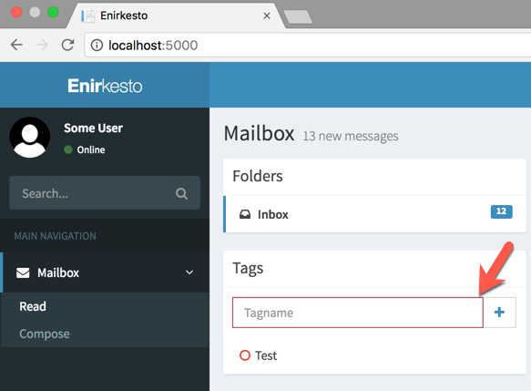
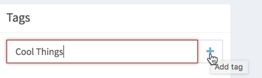
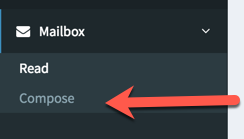
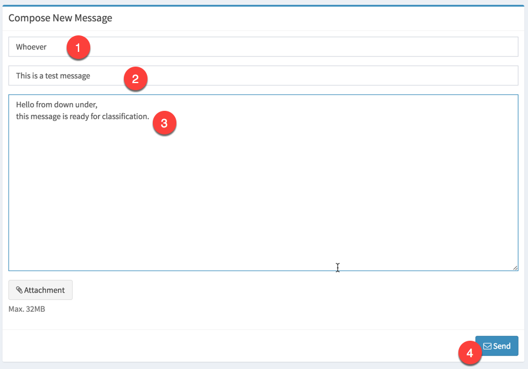
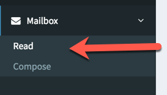
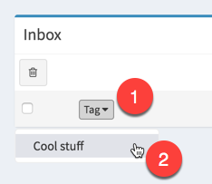
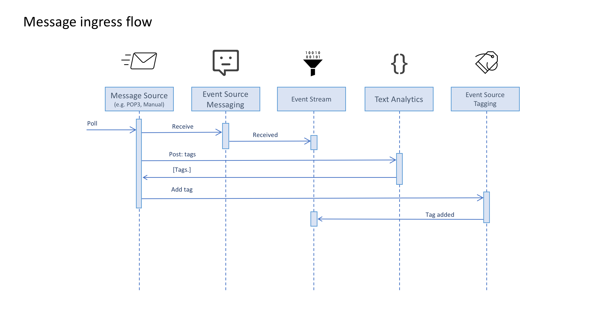
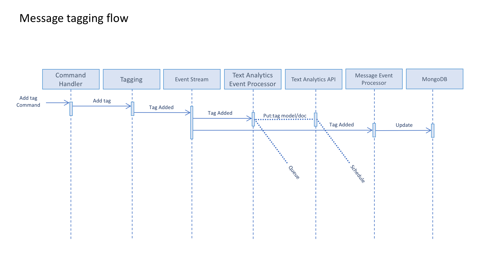

# Functionality

In the application there are different functionality. This document describes the most relevant ones and how they are used and how they flow through the system.

## Adding tags

The first thing one needs to start off with is to actually add tags into the system. Otherwise there is nothing to tag messages coming in with. The tags are unique per users mailbox.

Enter the tag name in the "Tagname" input:

Then click the plus button:

## Compose Message

To train the text analytics model, we will have to start tagging messages. In order to create a message that will be possible to tag, you can navigate to the compose page:

Fill out all the fields and then click send.

Navigate back to the reading list:

## Tagging messages

From the inbox list you will be able to see the message you put in and be able to tag it.

## Receiving messages

The goal when receiving messages is to be able to automatically tag them according to the trained model. The Flow below describes the steps it goes through with the [architecture](Architecture.md) its based on.

## Tagging

In the UI

